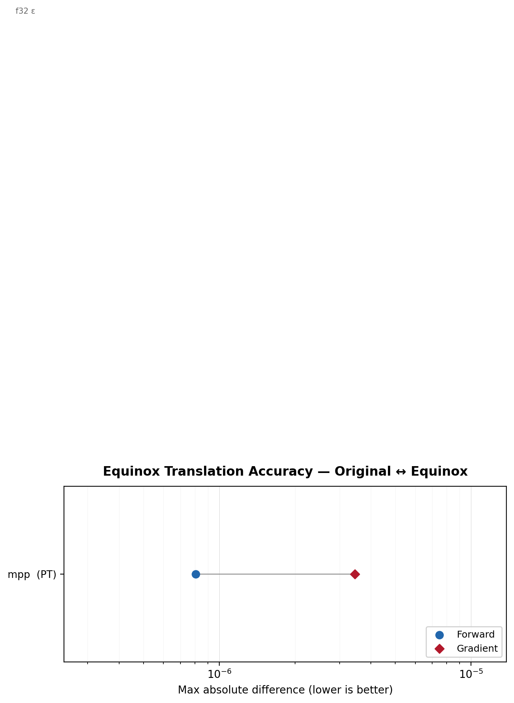

# foundax

<p align="center">
  
</p>

Unified JAX model zoo for operator learning, PDE surrogates, and Equinox foundation-model wrappers.

```
uv pip install foundax
```

## Overview

`foundax` provides two main model groups:

- Core Equinox architectures in `foundax/architectures/` (FNO, UNet, DeepONet, GNOT family, and others)
- Equinox wrappers for larger vendored model families (Poseidon, MORPH, MPP, Walrus, BCAT, PDEformer-2, DPOT, PROSE)

## Quick Start

```python
import foundax as fx

# Core models
model = fx.mlp(in_features=2, output_dim=1, hidden_dims=64, num_layers=3)
model = fx.fno2d(in_features=1, hidden_channels=32, n_modes=16)
model = fx.unet2d(in_channels=1, out_channels=1)
model = fx.deeponet(branch_type="mlp", trunk_type="mlp")

# Foundation wrappers (namespace style)
model = fx.poseidon.T()   # T/B/L
model = fx.morph.S()      # Ti/S/M/L
model = fx.mpp.B(n_states=12)  # Ti/S/B/L
model = fx.walrus.base()
model = fx.bcat.base()
model = fx.pdeformer2.small()  # small/base/fast
model = fx.dpot.Ti()      # Ti/S/M/L/H
model, variables = fx.prose.fd_1to1()
```

## Foundation Families

### Poseidon

```python
import foundax as fx
model = fx.poseidon.T()
```

### MORPH

```python
import foundax as fx
model = fx.morph.Ti()
```

### MPP

```python
import foundax as fx
model = fx.mpp.Ti(n_states=12)
```

### Walrus

```python
import foundax as fx
model = fx.walrus.base()
```

### BCAT

```python
import foundax as fx
model = fx.bcat.base()
```

### PDEformer-2

```python
import foundax as fx
model = fx.pdeformer2.small()
```

### DPOT

```python
import foundax as fx
model = fx.dpot.Ti()
```

### PROSE

```python
import foundax as fx
model, variables = fx.prose.fd_1to1()
```

## Documentation

Repository documentation lives in `docs/` and is built with MkDocs.

### Local preview

```bash
uvx --from mkdocs mkdocs serve
```

### Build

```bash
uvx --from mkdocs mkdocs build
```

## Integration With jNO

```python
import foundax as fx
import jno

net = jno.nn.wrap(fx.mlp(in_features=2, output_dim=1))
net.optimizer(optax.adam, lr=1e-3)
```

## Numerical Comparison To Original Models

<p align="center">
  
</p>

## Notes

- Top-level convenience aliases are still available (for example `fx.poseidonT()`), but namespace-style access is recommended for readability.
- Foundation-model wrappers are documented in detail in `docs/equinox-architectures.md`.

## License

This project is licensed under the [MIT License](LICENSE).

Foundation models remain subject to their original licenses.
See [THIRD_PARTY_LICENSES](THIRD_PARTY_LICENSES) for details.
Some pretrained weights (for example Poseidon) are released under non-commercial terms.
