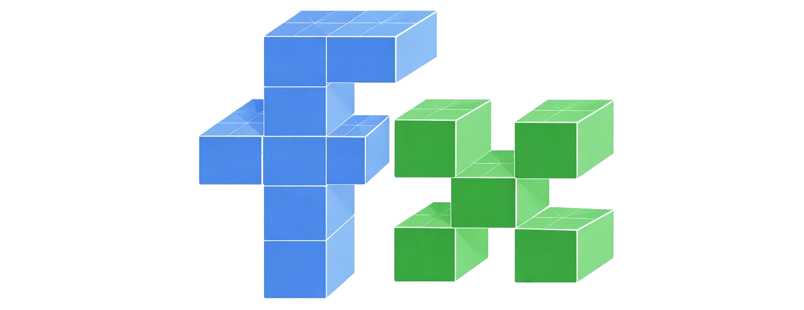

# foundax

<p align="center">
  
</p>

<p align="center">
    <a href="LICENSE">
        
    </a>
    <a href="https://huggingface.co/FhG-IISB/foundax">
        
    </a>
</p>

Unified JAX model zoo for operator learning, PDE surrogates, and Equinox foundation-model wrappers.

```
pip install foundax
```

## Overview

`foundax` provides two main model groups:

- Core Equinox architectures in `foundax/architectures/` (FNO, UNet, DeepONet, GNOT family, and others)
- Equinox wrappers for larger vendored model families (Poseidon, MORPH, MPP, Walrus, BCAT, PDEformer-2, DPOT, PROSE)

## Quick Start

```python
import foundax as fx

# Core models
model = fx.mlp(in_features=2, output_dim=1, hidden_dims=64, num_layers=3)
model = fx.fno2d(in_features=1, hidden_channels=32, n_modes=16)
model = fx.unet2d(in_channels=1, out_channels=1)
model = fx.deeponet(branch_type="mlp", trunk_type="mlp")

# Foundation wrappers (namespace style)
model = fx.poseidon.T()   # T/B/L
model = fx.morph.S()      # Ti/S/M/L
model = fx.mpp.B(n_states=12)  # Ti/S/B/L
model = fx.walrus.base()
model = fx.bcat.base()
model = fx.pdeformer2.small()  # small/base/fast
model = fx.dpot.Ti()      # Ti/S/M/L/H
model, variables = fx.prose.fd_1to1()
```

## Composable Pipe API

Wrap any model or layer with `fx.block()` and chain them with `|`.
Channel mismatches are caught at construction time with a clear error message.

```python
import jax
import foundax as fx

ks = jax.random.split(jax.random.PRNGKey(0), 8)

# ── Build a 2-D FNO-style pipeline from individual spectral layers ──────────
lift    = fx.block(fx.layers.SpectralBlock2d(1,  32, n_modes=16, key=ks[0]), name="lift")
s1      = fx.block(fx.layers.SpectralBlock2d(32, 32, n_modes=16, key=ks[1]))
s2      = fx.block(fx.layers.SpectralBlock2d(32, 32, n_modes=16, key=ks[2]))
s3      = fx.block(fx.layers.SpectralBlock2d(32, 32, n_modes=16, key=ks[3]))
project = fx.block(fx.layers.SpectralBlock2d(32,  1, n_modes=16, key=ks[4]), name="project")

model = lift | s1 | s2 | s3 | project   # Pipe of 5 blocks

# ── Existing full models work as blocks too ──────────────────────────────────
encoder = fx.block(fx.fno2d(in_features=3, hidden_channels=32, n_modes=16, key=ks[5]))
decoder = fx.block(fx.layers.SpectralBlock2d(32, 1, n_modes=16, key=ks[6]))

model = encoder | decoder

# ── Multi-input combinators (DeepONet-style) ─────────────────────────────────
branch = (
    fx.block(fx.layers.SpectralBlock1d(1, 32, n_modes=16, key=ks[0]))
    | fx.block(fx.mlp(in_features=32, output_dim=64, hidden_dims=64, key=ks[1]))
)
trunk = fx.block(fx.mlp(in_features=2, output_dim=64, hidden_dims=64, key=ks[2]))

model = fx.dot(branch, trunk)   # branch(u) · trunk(y)  →  (N_pts,)

# Also available: fx.add(a, b)  — elementwise sum of two branches
#                 fx.cat(a, b)  — concatenate outputs along the channel axis

# ── All pipe models are plain Equinox modules ────────────────────────────────
import equinox as eqx, optax, jax.numpy as jnp

opt   = optax.adam(1e-3)
state = opt.init(eqx.filter(model, eqx.is_array))

@eqx.filter_jit
def step(model, state, u, y, target):
    loss, grads = eqx.filter_value_and_grad(
        lambda m: jnp.mean((m(u, y) - target) ** 2)
    )(model)
    updates, state = opt.update(grads, state, eqx.filter(model, eqx.is_array))
    return eqx.apply_updates(model, updates), state, loss
```

Channel mismatches are caught immediately:

```python
b1 = fx.block(fx.layers.SpectralBlock2d(3, 32, n_modes=16, key=ks[0]), name="encoder")
b2 = fx.block(fx.layers.SpectralBlock2d(64,  1, n_modes=16, key=ks[1]), name="decoder")

b1 | b2
# foundax.ShapeMismatchError:
#   Channel mismatch: 'encoder' outputs 32 channels but 'decoder' expects 64.
#   Pipeline:
#     [0] encoder   in=3      out=32
#     [1] decoder   in=64     out=1    <-- mismatch here
#   Hint: change 'decoder' in_channels to 32, or insert a projection layer between them.
```

## Integration With jNO

```python
import foundax as fx
import jno
import optax

net = jno.nn.wrap(fx.poseidon.T(num_channels=5, num_out_channels=1))
net.optimizer(
    optax.chain(
        optax.clip_by_global_norm(1.0),
        optax.adamw(
            learning_rate=optax.schedules.warmup_cosine_decay_schedule(
                init_value=1e-7,
                peak_value=1e-3,
                warmup_steps=500,
                decay_steps=10000,
                end_value=1e-6,
            ),
            weight_decay=1e-4,
        ),
    )
)
net.initialize('./poseidonT.eqx')
net.mask(param_mask).lora(rank=4)
```

## Notes

- Top-level convenience aliases are still available (for example `fx.poseidonT()`), but namespace-style access is recommended for readability.
- Foundation-model wrappers are documented in detail in `docs/equinox-architectures.md`.

## License

This project is licensed under the [MIT License](LICENSE).

Foundation models remain subject to their original licenses.
See [THIRD_PARTY_LICENSES](THIRD_PARTY_LICENSES) for details.
Some pretrained weights (for example Poseidon) are released under non-commercial terms.
